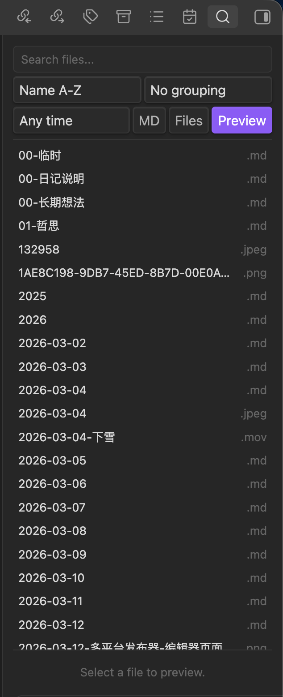
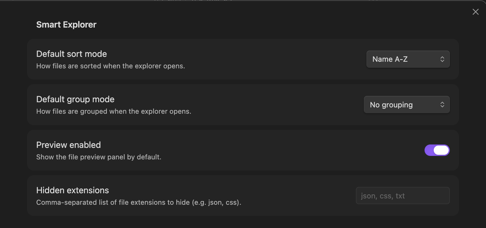

# Smart Explorer

An alternative Obsidian side-pane file explorer with custom sorting, grouping, filtering, and lightweight previews.

Designed for users with large vaults who need faster, more flexible navigation than the default file tree.





## Features

**Sorting** — Sort files by:
- Name (A-Z / Z-A)
- Modified date (newest / oldest)
- Created date (newest / oldest)
- File extension
- File size

**Grouping** — Group files by:
- Folder
- File extension
- Modified month
- Top-level folder

**Filtering** — Narrow results with:
- Search by file name or path
- Markdown-only toggle
- Attachments-only toggle
- Modified within last day / 7 days / 30 days

**Preview Panel** — See file context without opening:
- Markdown: first heading and tags
- Images: thumbnail preview
- Other files: type, size, and modified date

**Settings** — Persist defaults:
- Default sort and group mode
- Preview panel on/off
- Hidden file extensions

## Installation

### Manual

1. Download `main.js`, `manifest.json`, and `styles.css` from the [latest release](../../releases)
2. Create a folder named `smart-explorer` in your vault's `.obsidian/plugins/` directory
3. Copy the three files into that folder
4. Enable the plugin in Obsidian Settings → Community Plugins

### From source

```bash
git clone https://github.com/rogerdigital/smart-explorer.git
cd smart-explorer
npm install
npm run build
```

Then copy `main.js`, `manifest.json`, and `styles.css` to your vault's plugin folder.

## Usage

1. Open via the ribbon icon (search icon) or Command Palette → `Smart Explorer: Open`
2. Use the toolbar to sort, group, and filter files
3. Click a file to open it; the preview panel updates with file context
4. Configure defaults in Settings → Community Plugins → Smart Explorer

## Privacy

This plugin does not make any network requests. All data stays local in your vault.

## Limitations

- Read-only: no file rename, move, or delete operations
- No drag-and-drop support
- No custom manual ordering
- No full-text content search

## Development

```bash
npm install       # install dependencies
npm run dev       # watch mode for development
npm run build     # production build
npm test          # run unit tests
```

## License

[MIT](LICENSE)
