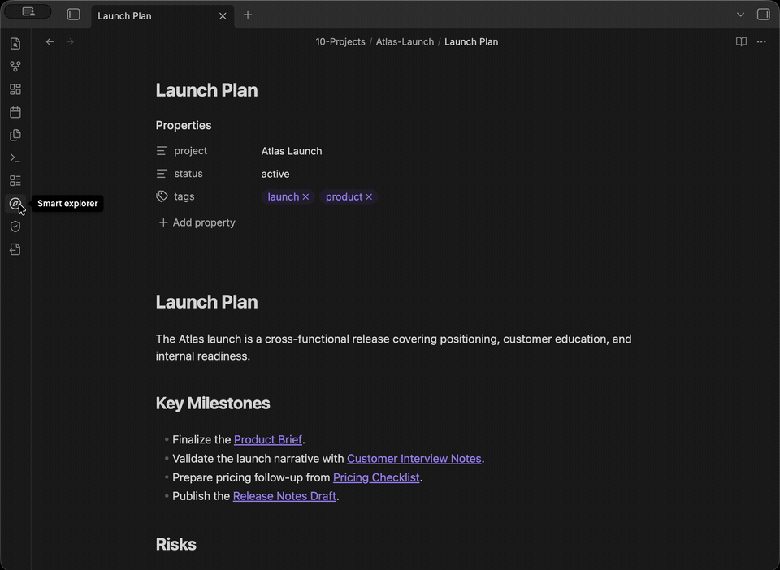

# Smart Explorer

A smarter side-pane explorer for browsing, filtering, and manually sorting your [Obsidian](https://obsidian.md) files.

Built for vaults with hundreds or thousands of notes where the default file tree falls short, especially project folders that need a human priority order instead of only alphabetical sorting.



## Features

| Category | Options |
|----------|---------|
| **Sort** | Name (A-Z / Z-A), modified date, created date, extension, file size, manual (drag-and-drop) |
| **Group** | Folder, extension, modified month, top-level folder |
| **Filter** | Search by name/path, markdown-only, attachments-only, date range (1d / 7d / 30d) |
| **Saved views** | Built-in views plus custom saved combinations of search, filters, sort, and group |
| **Settings** | Default sort/group mode, hidden extensions, reset manual order |

### Manual Drag-and-Drop Sorting

Switch to **Manual** sort mode, click **Edit order**, then drag files to reorder them exactly how you want. Use **Undo** to revert the last reorder. The custom order is saved per vault and persists across sessions. Works on both desktop and mobile (long-press to drag).

## Installation

### Community Plugins (recommended)

1. Open **Settings → Community Plugins → Browse**
2. Search for **Smart Explorer**
3. Click **Install**, then **Enable**

### Manual

1. Download `main.js`, `manifest.json`, and `styles.css` from the [latest release](https://github.com/rogerdigital/smart-explorer/releases)
2. Create `.obsidian/plugins/smart-explorer/` in your vault
3. Copy the three files into that folder
4. Enable in **Settings → Community Plugins**

## Usage

1. Open via ribbon icon or Command Palette → **Smart Explorer: Open**
2. Toolbar controls sorting, grouping, and filtering
3. Save frequent toolbar combinations as custom views
4. Click a file to open it in Obsidian
5. Defaults persist in **Settings → Community Plugins → Smart Explorer**

## Compatibility

- Obsidian ≥ 1.7.2
- Desktop and mobile

## Privacy

No network requests. All data stays local in your vault.

## Development

```bash
npm install       # install dependencies
npm run dev       # watch mode
npm run build     # type-check + production build
npm test          # unit tests
```

## License

[MIT](LICENSE)
