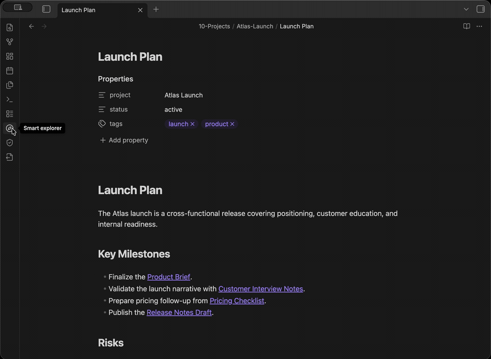

# Smart Explorer

A tree-first side-pane explorer for browsing, filtering, and manually sorting your [Obsidian](https://obsidian.md) files.

Built for vaults with hundreds or thousands of notes where the default file tree falls short, especially project folders that need a human priority order instead of only alphabetical sorting.



## Features

| Category | Options |
|----------|---------|
| **Browse** | Folder tree by default, with folder counts and compact hover details; closed folders render lazily and long ungrouped, non-manual flat lists use windowed rendering |
| **Create** | Create notes and folders via toolbar, context menu, or command palette — with inline name editing |
| **Edit** | Rename files and folders inline (file extensions stay fixed); move items to the configured trash from the context menu |
| **Sort** | Name (A-Z / Z-A), modified date, created date, extension, file size, manual drag order |
| **Filter** | Search by name/path, extension, file kind (all / markdown / non-markdown / images), date range (1d / 7d / 30d) |
| **View** | Tree/list toggle — the mode is remembered between sessions; Manual sort automatically uses list mode for direct drag-and-drop |
| **Commands** | Open, focus search, reveal active file, new note, new folder — all in the Command Palette |
| **Keyboard** | Full keyboard navigation: arrows move through rows, Home/End jump, arrow keys open and close folders, Enter opens files, and `Alt+Arrow` reorders files in Manual mode |
| **Settings** | Default sort/group mode, hidden extensions, reset manual order |

### Manual Drag-and-Drop Sorting

Switch to **Manual** sort mode to drag the handle beside a file and reorder it, or keep your hands on the keyboard and use `Alt+ArrowUp` / `Alt+ArrowDown` on the selected file. The starting order matches whatever sort you were viewing ("what you see is what you drag"), shown in a toolbar hint. Manual ordering uses an ungrouped list; tree and grouped manual ordering are not supported. Use **Undo** to revert the last reorder. Undo changes order only: it does not reverse creates, renames, or deletions. Renamed files retain their historical positions, deleted files stay removed, and new files remain sortable, including after Undo. The custom order is saved per vault and persists across sessions.

Rename tracking continues while all Smart Explorer panes are closed, provided the plugin remains enabled. Renames made while the plugin is disabled or Obsidian is not running cannot reliably retain positions because order is stored by path.

## Installation

### Community Plugins (recommended)

1. Open **Settings → Community Plugins → Browse**
2. Search for **Smart Explorer**
3. Click **Install**, then **Enable**

### Manual

1. Download `main.js`, `manifest.json`, and `styles.css` from the [latest release](https://github.com/rogerdigital/smart-explorer/releases)
2. Create `.obsidian/plugins/smart-explorer/` in your vault
3. Copy the three files into that folder
4. Enable in **Settings → Community Plugins**

## Usage

1. Open via ribbon icon or Command Palette → **Smart Explorer: Open**
2. Use the first toolbar row for tree/list mode, sorting, new notes/folders, search, and filters
3. Click search to reveal the search box; click filters for grouping, extension, file kind, and modified-date filters. Extension and file-kind filters can be combined.
4. Click a file to open it in Obsidian
5. Use the clear button near the file count to clear active search and filters
6. Defaults persist in **Settings → Community Plugins → Smart Explorer**

### Keyboard & Commands

- `Cmd/Ctrl+F` focuses the search box
- `Esc` clears search text or closes the filter row
- `Arrow Up/Down` moves through rows; `Home`/`End` jump to the first/last row
- `Arrow Right/Left` opens/closes the focused folder in tree mode
- `Enter` or `Space` opens the focused file or toggles the focused folder
- `Alt+ArrowUp` / `Alt+ArrowDown` moves the selected file in Manual sort mode (announced via screen reader)
- Command Palette actions: **Smart Explorer: Open**, **Focus search**, **Reveal active file**, **New note**, **New folder**

## Compatibility

- Obsidian ≥ 1.7.2
- Desktop and mobile are declared supported; candidate-specific runtime verification is tracked in the [1.0 readiness report](docs/verification/1.0.0-readiness.md).
- The 1.0 candidate is not release-approved until required desktop, real iOS/Android, minimum-version, upgrade, accessibility, and performance gates pass.

## Privacy

No network requests. Explicit user actions can create notes or folders, rename files or folders, and move items to the configured trash. Renaming follows Obsidian's internal-link update preference. Plugin settings and manual order are saved locally, including path maintenance after vault renames while the plugin is enabled.

## Development

```bash
npm install          # install dependencies
npm run dev          # watch mode
npm run build        # type-check + production build
npm test             # unit, DOM, and integration tests
npm run lint         # eslint
npm run test:release # release-validator and workflow tests
npm run test:fixture # fixture-script safety tests
npm run verify       # lint + production build + Jest + release + fixture tests
```

## License

[MIT](LICENSE)
